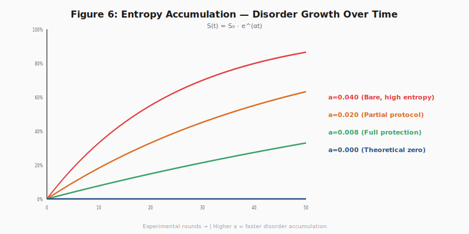

# Silent Failure

**Silent Failure in LLM Agent Systems: The Entropy Principle and the Inevitable Disorder of Autonomous Agents**

📄 Paper: [arXiv:2606.08162](https://arxiv.org/abs/2606.08162) (v1, 2026-06-06)  
👤 Author: **Dexing Liu（刘德星）**  
🏢 Affiliation: Shanghai Qijing Digital Technology Co., Ltd.  
🌐 More from ADE Standard: [github.com/ADE-standard](https://github.com/ADE-standard)

---

## Overview

LLM agent systems suffer from a class of failures that occur **without external triggers** — no injection, no adversarial input, no resource exhaustion. These **silent failures** — unexpected deviations from intended behavior under normal operating conditions — are routinely misattributed to bugs or configuration errors.

Through systematic analysis of over **40,000 controlled trials** and long-term production observations spanning **100,000+ agent interactions**, we identify a common structural logic behind these failures: the **Entropy Principle**.

> *Agent systems, as probabilistic constructs, naturally accumulate disorder over time. Silent failure is not an anomaly — it is the expected steady state of any autonomous agent system operating without active stability engineering.*

## Key Contributions

| Contribution | Description |
|:---|:---|
| **Entropy Principle** | First formal articulation: LLM agent systems exhibit an entropy-like tendency toward disorder — `S(t) = S₀ · e^(αt)` |
| **Silent Failure Taxonomy** | Four classes: Channel Fracture (CF), Congestion Failure (CFL), Data Decay, Knowledge Fracture |
| **Controlled Experiments** | 40,000+ trials with statistically significant degradation patterns |
| **Production Evidence** | Real-world failure patterns from running multi-agent systems, including response time degradation, state.db bloat, and WebSocket channel fracture |
| **ADE Countermeasures** | Demonstrates how structured engineering protocols (BCP, CADVP, TLC, PIG) systematically reduce entropy accumulation |

## Silent Failure in the Wild

The paper documents four real-world silent failure instances from production multi-agent systems:

| Instance | Type | Duration | Consequence |
|:---|:---|:---|:---|
| **State.db Entropy** | Data Decay | 7 days | Response times 12.9s → 1866.5s, FTS index ballooned 18.3× |
| **Gateway Channel Fracture** | CF (Channel Fracture) | 5 days | 5 confirmed duplicate message deliveries to WeCom users |
| **Cron Knowledge Fracture** | KF (Knowledge Fracture) | Post-restart | 15 cron jobs zeroed out after system reboot |
| **Congestion Failure** | CFL | Intermittent | Cross-session cognitive framework regression |

## Visualizing the Entropy Principle



*The entropy function S(t) = S₀ · e^(αt) governing the disorder accumulation in agent systems. α is the system-specific degradation coefficient.*

## Citation

```bibtex
@misc{liu2026silent,
  author = {Dexing Liu},
  title = {Silent Failure in {LLM} Agent Systems: The Entropy Principle and the 
           Inevitable Disorder of Autonomous Agents},
  year = {2026},
  eprint = {2606.08162},
  archivePrefix = {arXiv},
  primaryClass = {cs.MA}
}
```

## ADE — Agent Delivery Engineering

This work is part of the **Agent Delivery Engineering (ADE)** framework — a systematic engineering discipline that treats deployment-time agent stability as a first-class problem. ADE protocols (BCP, CADVP, TLC, PIG, SOMA, TKM) provide structured countermeasures against the entropy-driven disorder that this paper formally characterizes.

Read more at [Agent Delivery Engineering](https://github.com/ADE-standard/agent-delivery-engineering).

## Repository Structure

```
silent-failure/
├── README.md              # This file
├── papers/                # Paper PDFs
│   └── silent-failure.pdf
├── figures/               # All 7 paper figures (PNG)
├── evidence/              # Real-world evidence data
│   ├── state-db-entropy/  # State.db degradation logs
│   └── cfl-instance/      # Cognitive Framework Lag instances
├── LICENSE
└── .gitignore
```

## Security Notice

The paper characterizes the **problem** — the entropy-driven disorder in agent systems. The full **ADE protocol specifications** (BCP, CADVP, TLC, PIG, etc.) that solve these problems are proprietary. Contact [qijing@qijing.ai](mailto:qijing@qijing.ai) for commercial licensing.

## License

All Rights Reserved. Academic research use is free. Commercial use requires authorization.
